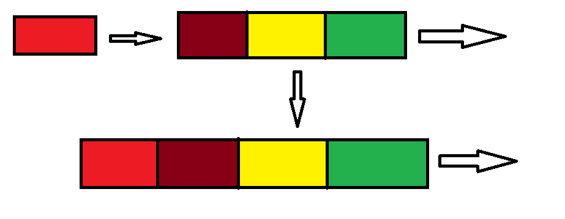
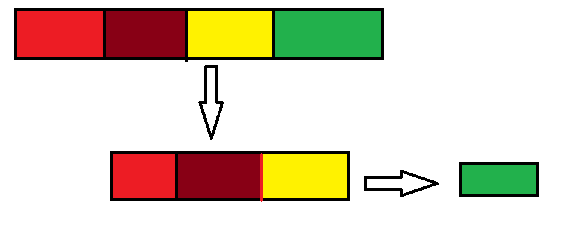

**II-Queue**

1. Definition (Enqueue/Dequeue)

In Data structure, a queue consists of a list of records such that records are added at one end and removed from the other. It follows the FIST-IN-FIST-OUT (FIFO) principle. In other word enqueuing (first-in) and dequeuing (first-out). 
 

* Enqueue

Enqueuing, is adding an element to the end of the queue. Lets assume we are in a line at a counter. the first person to enter the line will definately be the one at the begining of the line no matter how long the line gets.

Lets look at the following piagram:



In this diagram, we are enqueueing the red box to the rest of the boxes. So it will be added to at the end of the line.

* Implementing 

Lets consider a queue of persons in a line:

\#lets enqueue some persons into the list

```
person = []
person.append('Franck')
person.append('Mark')
person.append('Ella')
person.append('Emerauld')
print(person) 

#result: ['Franck','Mark','Ella','Emerauld']

```
Here we use the "append" operation of the list to simulate the core operations of a queue.


* Dequeue

Dequeuing, is removing an element at the beggining of the queue. With our previous example, we are in a line at a counter. the first person to enter the line will be the first to be taking care of at the counter, therfore the first to exit the queue.

Lets look at the following piagram:



In this diagram, we are dequeueing a box from the rest of the boxes. So the first one in the line; The green box  will be separated from the rest of the boxes.

* Implementing 

Lets consider the presious queue of persons in a line:

```
#lets enqueue some persons into the list 

person = []
person.append('Frank')
person.append('Mark')
person.append('Ella')
person.append('Emerauld')

#Now lets dequeue a person from the list

first_person = person.pop(0)
print(first_person) 

#result: ['Frank']

```
Here we use the "pop" operation of the list to simulate the core operations of a queue.

* Performance

Accessing a specific element of the Queue can be done in linear time O(n), as we need to traverse it. But we usually have a pointer/reference to the first and last element of the queue. Therefore both enqueue and dequeue can be performed in constant time O(1).

*  [Problem](queue-problem.py)

Try the problem first before looking at the solution

* [Solution](queue-solution.py)


