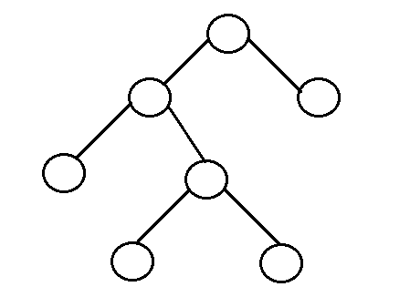
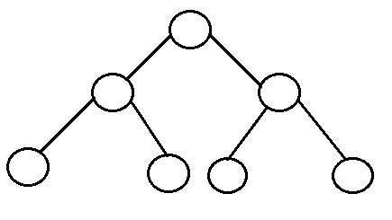
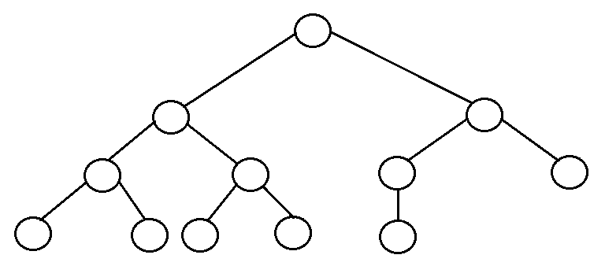
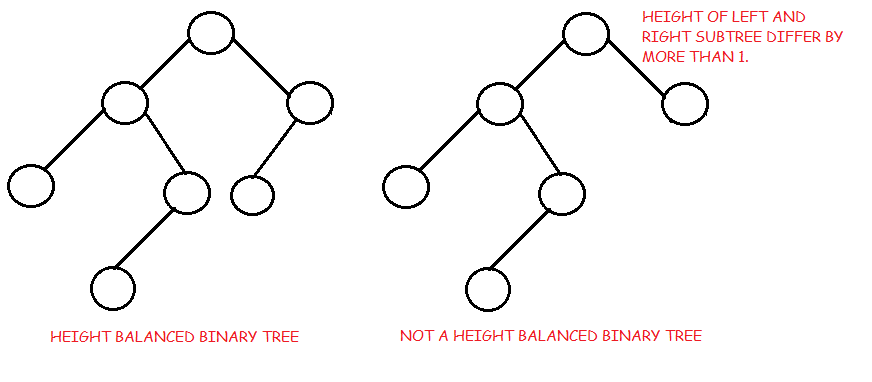
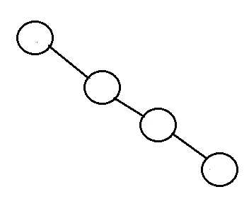

**IV-TREE**

1. Definition 

A tree is a non linear data structure as opposed to stack, linked list and queues. As the name indicates, tree needs to have at most 2 elements called binary tree. Since each element in a binary tree can have only 2 children, we typically name them the left and right child. 
Each node contains three components:

Pointer to left subtree
Pointer to right subtree
Data element
 

2. Types of tree

* Full binary tree

It is a tree in which every node in the tree has either 0 or 2 children.



* Perfect binary tree

 It is a binary tree in which all interior nodes have two children and all leaves have the same depth or same level.
 

* complete binary tree

It is a binary tree in which every level, except possibly the last, is completely filled, and all nodes are as far left as possible.


* Balanced binary tree

A binary tree is height balanced if the left and right subtrees' heights differ by at most one, AND
The left subtree is balanced, AND
The right subtree is balanced.
An empty tree is height balanced. This produces an o(logn) performance.


* Degenerated binary tree

It is a tree is where each parent node has only one child node. It behaves like a linked list. This produces a O(n) performance because it is not balabed.


3. Implementing 

* Binary search tree

```
# Function to search a given key in BST

def search(root, key):

    # Base Cases: root is null or key is present at root
    if root is None or root.val == key:
        return root

    # Key is greater than root's key
    if root.val < key:
        return search(root.right, key)

    # Key is smaller than root's key
    return search(root.left, key)

```

* Insert in a BST

when inserting data in a tree, the greater values are added to the right while the smaller to the left.


*  [Problem](queue-problem.py)

Try the problem first before looking at the solution

* [Solution](queue-solution.py)


